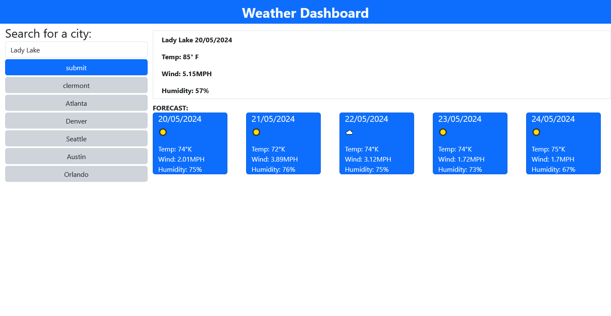

# WeatherApi

allows user to search a city and gives 5 day forcast for that city

## Usage
[https://kalink52.github.io/WeatherApi/](https://kalink52.github.io/WeatherApi/)

## Contributing

Pull requests are welcome. For major changes, please open an issue first
to discuss what you would like to change.

Please make sure to update tests as appropriate.

## License

[MIT](https://choosealicense.com/licenses/mit/)